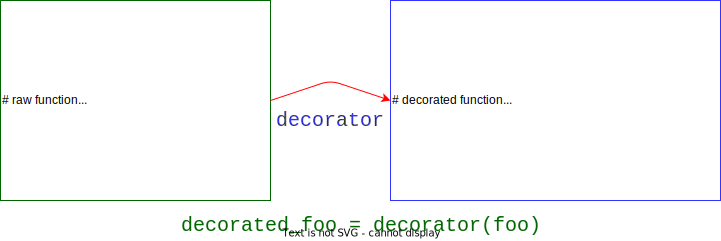

---
jupytext:
  encoding: '# -*- coding: utf-8 -*-'
  text_representation:
    extension: .md
    format_name: myst
kernelspec:
  display_name: Python 3 (ipykernel)
  language: python
  name: python3
language_info:
  name: python
  nbconvert_exporter: python
  pygments_lexer: ipython3
nbhosting:
  title: "d\xE9corateurs"
---

# décorateurs

en guise de complément, ce notebook introduit la notion de *decorator*

+++

## déjà rencontré

on a déjà rencontré les décorateurs lorsqu'on a vu les méthodes statiques et les méthodes de classe

```python

class Foo:
    
    @staticmethod
    def load_from_file(filename):
        instance = Foo(...)
        return instance
```

dans cette notation, `staticmethod` est un **décorateur**  
nous allons voir ça plus en détail

+++

## pourquoi faire ?

l'idée du décorateur, c'est de **transformer** une fonction pour en déduire une autre fonction, qui fait un peu plus de choses que la première

exemples

* je veux afficher un message en entrant et en sortant de la fonction
* je veux compter le nombre de fois qu'une fonction est appelée
* je veux 'cacher' les résultats de la fonction que j'ai déjà calculés
* ...

+++

## principe

* un décorateur, c'est donc un bidule qui transforme une fonction en une autre fonction
* de quelle nature est ce bidule ? une fonction, bien sûr



````{admonition} en fait un callable
:class: admonition-small

en toute rigueur, on devrait dire qu'un décorateur est un *callable*  
voir plus bas pour plus de détails
````

+++

## exemple

essentiellement la même chose que sur la figure, avec quelques détails en plus:

* comment gérer tous les paramètres (`*args` *et* `**kwds`)
* comment trouver proprement le nom de la fonction

```{code-cell} ipython3
# pour débugger une fonction, c'est pratique
# de pouvoir afficher les arguments et le résultat

def decorator(foo):
    def decorated(*args, **kwds):
        print(f"IN {foo.__name__}({args=}, {kwds=})")
        result = foo(*args, **kwds)
        print(f"OUT {foo.__name__} -> {result}")
        return result
    return decorated        
```

```{code-cell} ipython3
:cell_style: split

# une fonction au hasard
def add(x, y):
    """
    la somme
    """
    return x + y
```

```{code-cell} ipython3
:cell_style: split

# la version décorée
# affiche les paramètres et le résultat
add1 = decorator(add)

add1(10, 20)
```

```{code-cell} ipython3
:cell_style: split

# on peut appliquer la même recette
# à n'importe quelle fonction
# une autre
def mul(x, y=10):
    return x * y
```

```{code-cell} ipython3
:cell_style: split

# la version décorée ... pareil
mul1 = decorator(mul)

mul1(10, y=20)
```

````{admonition} notez la signature

remarquez ici l'usage idiomatique de `*args` et `**kwds`  
puisqu'on veut pouvoir faire ça quelque soit la signature de `f`    
    
````

+++

## la syntaxe `@truc`

* bien sûr en pratique on nomme les décorateurs de manière plus explicite
* disons qu'on appelle le nôtre `print_in_out`

+++ {"cell_style": "split"}

au lieu d'écrire

```
def add(x, y):
    return x + y
    
add = print_in_out(add)
```

+++ {"cell_style": "split"}

on peut se contenter de

```python
@print_in_out
def add(x, y):
    return x + y
```

+++

## le module `functools`

il [expose quelques décorateurs d'usage courant](https://docs.python.org/3/library/functools.html);  
voyons un exemple d'utilisation du décorateur `cache`

```{code-cell} ipython3
# on part d'une implémentation super inefficace
# de la suite de fibonacci

def fibo(n):
    return 1 if n <= 1 else fibo(n-1) + fibo(n-2)
```

```{code-cell} ipython3
# la preuve

%timeit -n 1 -r 1 fibo(32)
```

```{code-cell} ipython3
:cell_style: split

# avec ce décorateur, la fonction va retenir les 
# calculs qu'elle a faits précédemment

from functools import cache

@cache
def fibo(n):
    return 1 if n <= 1 else fibo(n-1) + fibo(n-2)
```

```{code-cell} ipython3
:cell_style: split

# et du coup ça va plusieurs ordres de grandeur fois plus vite !

%timeit -n 1 -r 1 fibo(30)
```

## décorateur de classes

en fait le même principe s'applique aux classes; on peut concevoir une fonction qui prend en paramètre un objet classe et le transforme en une autre classe  
et en fait on en a aussi déjà vu un exemple, je vous renvoie à [la section sur les *dataclasses*](label-dataclasses)

+++

## conclusion

* un décorateur est un *callable* (par exemple une fonction) qui transforme une fonction en une version instrumentée de la fonction (ou une classe en une classe)
* avec la syntaxe  
  ```python
  @bidule
  def ma_fonction(...):
      ...
  ```
  on peut remplacer dans tout le code chaque appel à `ma_fonction` par un appel équivalent à la fonction décorée par `bidule`

* sachez aussi que les usages avancés des décorateurs permettent de passer des paramètres ... au décorateur lui-même; un sujet que je vous laisse creuser si vous êtes intéressé

+++

## les attributs de fonction (avancé)

* une fonction est un objet Python
* sur lequel on peut définir des attributs arbitraires
* et qui possède de base des attributs spéciaux

```{code-cell} ipython3
:cell_style: split

# quand on utilise `def` 
# on a gratuitement le nom

add.__name__
```

```{code-cell} ipython3
:cell_style: split

# et le docstring

add.__doc__
```

### préserver les attributs spéciaux

du coup, notre première implémentation est améliorable car

```{code-cell} ipython3
:cell_style: split

# ce n'est pas très parlant
# on aimerait avoir ici 'add'

add1.__name__
```

```{code-cell} ipython3
:cell_style: split

# pareil ici, on a perdu la docstring, c'est vide

add1.__doc__
```

```{code-cell} ipython3
:cell_style: split

# du coup on pourrait écrire quelque chose comme ceci  
# (mais voyez le slide suivant pour la 'bonne' façon de faire)

def decorator2(f):
    def decorated(*args, **kwds):
        print(f"IN {f.__name__}({args=}, {kwds=})")
        result = f(*args, **kwds)
        print(f"OUT {f.__name__}")
        return result
    decorated.__name__ = f.__name__
    decorated.__doc__ = f.__doc__
    return decorated        
```

```{code-cell} ipython3
:cell_style: split

add2 = decorator2(add)
add2.__name__, add2.__doc__
```

### préserver les attributs spéciaux (2)

ou encore, la méthode recommandée est d'utiliser .. le décorateur `wraps`  
qui va faire tout ce travail pour nous, avec une simple ligne en plus par rapport à la version naïve

```{code-cell} ipython3
:cell_style: split

from functools import wraps

def decorator3(f):
    @wraps(f)
    def decorated(*args, **kwds):
        print(f"IN {f.__name__}({args=}, {kwds=})")
        result = f(*args, **kwds)
        print(f"OUT {f.__name__}")
        return result
    return decorated        
```

```{code-cell} ipython3
:cell_style: split

# et maintenant on a bien tout comme on voulait

add3 = decorator3(add)

add3.__name__, add3.__doc__
```

## les callables (avancé)

ce sujet nous donne l'occasion de parler des *callables*

en réalité, un decorator n'est **pas nécessairement** une fonction; la vraie contrainte est qu'on **puisse l'appeler**, en lui passant en argument une fonction en paramètre  

et parmi les *protocoles* disponibles sur les classes Python, il y a la notion de *callable*, qui dicteque si une classe définit la méthode spéciale `__call__`, alors on peut utiliser ses instances comme une fonction - on peut donc *appeler* l'instance, d'où le terme de *callable*

+++

### un exemple simple

petite digression, juste pour bien voir cette notion de *callable* d'abord sur un exemple relativement simple

imaginons qu'on a écrit une classe `Line`  
qui possède comme attributs les termes $a$ et $b$ de l'équation $y = ax + b$

du coup chaque instance de cette classe peut être aussi vue comme une fonction qui a x fait correspondre le y calculé de cette façon

c'est très simple d'implémenter cette idée en Python

```{code-cell} ipython3
# pour le fun on va utiliser une dataclasse
# ça nous fera économiser le boiler plate usuel

# en plus ça nous permet de revoir ce concept
# qui n'est rien d'autre que .. un décorateur de classes

from dataclasses import dataclass

class Line:

    def __init__(self, a, b):
        self.a = a
        self.b = b
    # pour rendre nos objets callables
    def __call__(self, x):
        return self.a * x + self.b
    
```

```{code-cell} ipython3
# la droite y = 3x + 1
line = Line(3, 1)

# et cet objet peut être utilisé comme une fonction !
# pour x=2 on doit obtenir 3*2+1 = 7
line(2)
```

### un décorateur comme une classe

du coup on peut tirer profit de ce trait pour **implémenter notre décorateur**, non plus comme une fonction mais **comme une classe**  

pourquoi faire ça me direz-vous ?  
eh bien parce que cela permet de tirer profit de l'avantage que procure une classe: les objets retiennent un état, ce qui n'est pas le cas des fonctions  

pour le fun, voyons comment on pourrait implémenter le décorateur de cache de cette façon

````{admonition} stocker un état dans une fonction ?
:class: admonition-small

on dit souvent qu'une fonction ne conserve pas d'état, ce qui est vrai *a priori*  
sauf que le hacker qui est en vous a bien compris à présent qu'on peut tout à fait tricher, et ranger ce qu'on veut dans des attributs de la fonction; mais bon faisons comme si on n'avait pas vu ça :)
````

```{code-cell} ipython3
# to keep it simple, we support only positional arguments
# also the parameters must be hashable

# usually a decorator's name would be lowercase
# however we use CamelCase here to outline the fact
# that it is implemented as a class
class Cache:
    
    def __init__(self, f):
        self.f = f
        self.cached_values = dict()
    def __call__(self, *args):
        # 
        def decorated(*args):
            if args in self.cached_values:
                return self.cached_values[args]
            else:
                result = self.f(*args)
                self.cached_values[args] = result
                return result
        return decorated
```

```{code-cell} ipython3
# and with this in place we can use Cache as a decorator

@Cache
def fibo(n):
    if n <= 1:
        return 1
    else:
        return fibo(n-1) + fibo(n-2)
```

```{code-cell} ipython3
# and it is as efficient as expected

%timeit -n 1 -r 1 fibo(300)
```

### comment ça marche ?

on applique simplement les principes qu'on a vus jusqu'ici:

* on calcule `Cache(fibo)`
* qui se trouve être un objet *callable* car `Cache` implémente `__call__()`
* et c'est cet objet qui est appelé lorsqu'on écrit `fibo(300)`

+++

### épilogue

en élaborant sur ce principe on peut écrire toutes les combinaisons, i.e.:
- sous la forme d'une fonction un décorateur de fonction ou de classe
- sous la forme d'une classe un décorateur de fonction ou de classe

+++

## quelques exemples

voici pour finir quelques exemples de décorateurs un peu plus réalistes  
pour montrer aussi qu'on peut sans souci chainer les décorateurs...

```{code-cell} ipython3
from functools import wraps

def runtime(func):
    """
    Décorateur qui affiche le temps d'exécution d'une fonction
    """
    import time
    @wraps(func)
    def wrapper(*args, **kwargs):
        t = time.perf_counter()
        res = func(*args, **kwargs)
        print(func.__name__, time.perf_counter()-t)
        return res
    return wrapper
```

```{code-cell} ipython3
def counter(func):
    """
    Décorateur qui affiche le nombre d'appels à une fonction 
    """
    @wraps(func)
    def wrapper(*args, **kwargs):
        wrapper.count = wrapper.count + 1
        res = func(*args, **kwargs)
        print("{} was called {} times".format(func.__name__, wrapper.count))
        return res
    wrapper.count = 0
    return wrapper
```

```{code-cell} ipython3
def logfunc(func):
    """
    Décorateur qui log l'activité d'une fonction.
    """
    @wraps(func)
    def wrapper(*args, **kwargs):
        res = func(*args, **kwargs)
        s = """
The function *{}* was called with
    positional arguments: {}
    named arguments: {}
The returned value: {}
"""
        print(s.format(func.__name__, args, kwargs, res))
        return res
    return wrapper
```

```{code-cell} ipython3
:lines_to_next_cell: 3

@logfunc
@counter
@runtime
def test(num, L):
    for i in range(num):
        'x' in L
    return 'Done'

test(100000, range(10))
```
