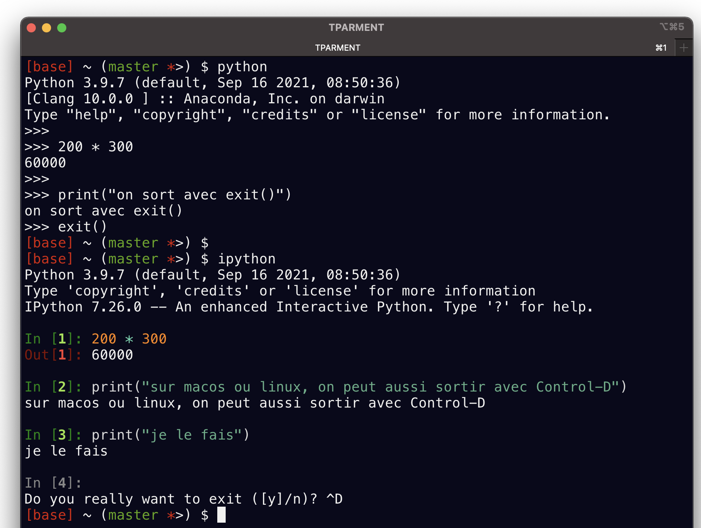

+++ {"slideshow": {"slide_type": "slide"}}

<div class="licence">
<span>Licence CC BY-NC-ND</span>
<span>Thierry Parmentelat &amp; Arnaud Legout</span>
</div>

+++

# introduction 


> *Python3 : des fondamentaux à l'utilisation du langage*

+++ {"cell_style": "center"}

> version de référence: python-3.7

```{code-cell} ipython3
---
slideshow:
  slide_type: slide
---
# le plan : survol
from plan import plan; plan("intro")
```

```{code-cell}
---
slideshow:
  slide_type: slide
---
# le plan : un peu plus de détails
from plan import plan; plan()
```

+++ {"slideshow": {"slide_type": "slide"}}

## comment lancer python ?

+++

### depuis un terminal ...

* taper `python` dans le terminal
  * interpréteur en ligne de commande
* en option, `ipython` en remplacement
  * nécessite une installation supplémentaire
  * `pip3 install ipython`

+++ {"slideshow": {"slide_type": "slide"}, "cell_style": "split"}



+++ {"slideshow": {"slide_type": "slide"}, "cell_style": "split"}

***Note***

*sur des installations un peu anciennes on peut avoir à taper `python3` ou `ipython3`*

+++ {"slideshow": {"slide_type": "slide"}}

### ... ou dans un environnement graphique

+++ {"cell_style": "center"}

* IDLE, basique voire rustique, mais suffisant pour nos besoins
* celui de votre choix (PyCharm, SublimeText, atom, vscode, eclipse, ... trop de variantes)
* Jupyter notebook

+++ {"cell_style": "split"}

dans tous les cas, faites un premier test:

```{code-cell}
:cell_style: split

200 * 300
```

important: savoir redémarrer son interpréteur

+++ {"slideshow": {"slide_type": "slide"}}

## pourquoi Python ?

+++

* syntaxe simple
  * pas de délimitations  `; {} () []`
  * uniquement des indentations
  * aucune ambiguïté
  * une seule façon d’écrire
* portable
  * Windows, Linux, Mac OS, etc.
* typage dynamique

+++ {"slideshow": {"slide_type": "slide"}}

### pourquoi Python ?  : lisible

```{code-cell}
# le sucre syntaxique réduit au minimum
# c'est un partis-pris de conception
# le code est lisible par construction
def factorielle(n):
    return 1 if n <= 1 else n * factorielle(n-1)
```

```{code-cell}
factorielle(0)
```

```{code-cell}
factorielle(8)
```

+++ {"slideshow": {"slide_type": "slide"}}

### pourquoi Python ? : puissant

+++

* types disponibles très puissants et flexibles
  * entiers non bornés, complexes
  * listes, strings
  * tables de hash pour dictionnaires et ensembles 
  * langage orienté objet : définir ses propres types
* énorme base de librairies 
  * et s’interface facilement avec C et C++
* gestion de la mémoire automatique
  * GC

+++ {"slideshow": {"slide_type": "slide"}}

### pourquoi Python ? : pas de compilation

+++

* langage interprété
* pré-compilation en byte-code des programmes (.pyc)
  * portable
  * jamais à s'en soucier
  * interprété dans la Python Virtual Machine (PVM)
  * mais pas optimisé comme du code machine  
    compilé à partir de C

* script direct en ligne de commande

+++ {"slideshow": {"slide_type": "slide"}}

### pourquoi python ? : ouvert et gratuit

+++

## la Python Software Foundation (PSF)

possède les droits sur Python et assure son développement

* essentiellement aucune restriction sur le code Python et son usage, même commercial
* https://docs.python.org/3.5/license.html

+++ {"slideshow": {"slide_type": "slide"}}

### philosophie python

```{code-cell}
import this
```

+++ {"slideshow": {"slide_type": "slide"}}

## quand utiliser python ?

+++

* scripts (mais pas **uniquement** ça!)
* programmation système
* internet
* base de données
* prototypage rapide
* calcul scientifique
* exploration dans les données

+++ {"slideshow": {"slide_type": "slide"}}

### quand ne pas utiliser Python ?

+++

* Python est **plutôt gourmand en mémoire**
  * tout est objet ➔ surcoût partout
  * exemples sur une machine 64 bits

|      objet     |   octets  | natif C |  
|----------------|-----------|---------|
| petit entier   | 28 octets |8 octets|
| chaine 'a'     | 50 octets |1 octet|
| chaine 'é'     | 74 octets |2 octets|

* Python plutôt bon en termes de vitesse
  * fonctions de base implémentées en C optimisé
  * PyPy très rapide par rapport à CPython
  * pensez à utiliser `numpy`

+++ {"slideshow": {"slide_type": "slide"}}

### quand ne pas utiliser python ?

+++

**comment prendre la décision d’utiliser Python ?**

* balancer vitesse de développement avec performance
* Python gagne presque toujours

+++ {"slideshow": {"slide_type": "slide"}}

### comment tester la performance ?

+++

* taille
  * `sys.getsizeof(object)`

* vitesse
  * `cProfile.run('maFonction()')`
  * `timeit.timeit(stmt='maFonction()', number=10000)`

```{code-cell}
---
cell_style: split
slideshow:
  slide_type: slide
---
import sys
sys.getsizeof([10])
```

```{code-cell}
:cell_style: split

sys.getsizeof([10, 20])
```

```{code-cell}
sys.getsizeof([10, 20, 30])
```

```{code-cell}
---
slideshow:
  slide_type: slide
---
%%timeit
[x**2 for x in range(10000)]
```

+++ {"slideshow": {"slide_type": "slide"}}

## quelle version de python ?

+++

* version 3.x (actuellement 3.7)
  * **toutes** les librairies usuelles supportent 3.x
  * **recommandé** pour un nouveau projet
  * compatible ascendant à partir de 3.0
  
* ~~version 2.7~~
  * en fin de vie - supporté jusque 1er janvier 2020 
  * initialement annoncé jusque 2015
  * certains projets ont déjà cessé de le supporter

+++ {"slideshow": {"slide_type": "slide"}}

### quelle version de python ?

+++

* 3.x corrige des gros défauts de 2.x
  * caractère &nbsp;$\neq$&nbsp;&nbsp;octet (`bytes` et `str`)
  * `print` et `exec` sont des **fonctions**
  * **itérateurs** plutôt que listes (`range` etc.)
  * `/` n'est plus la division entière
  * etc.
* **attention**
  * 2.x et 3.x ne sont **pas compatibles**
  * outil de conversion `2to3`

+++ {"slideshow": {"slide_type": "slide"}}

## documentation

+++

### In english (un peu ancien à présent)

* Learning Python, 5th Edition, Mark Lutz
  * niveau débutant à confirmé
* Programming Python, 4th Edition, Mark Lutz
  * niveau confirmé

<span style="float:left;"></span>
<span style="float:right;"></span>

+++ {"slideshow": {"slide_type": "slide"}}

### in english

* Python tutorial, https://docs.python.org/3/tutorial/
  * initialement Guido van Rossum
  * niveau débutant à moyen
  * fourni avec Python (donc gratuit)
* Python Manuals
  * google -> `python manuals`
  * google -> `python argparse`
  * (https://www.google.com/search?q=python+argparse)
  * **vérifier** version (**3.7** plutôt que 2.7)

+++ {"slideshow": {"slide_type": "slide"}}

### en français

* MOOC Python : des fondamentaux à l'utilisation du langage
  * A. Legout et T. Parmentelat
* http://fr.openclassrooms.com/informatique/cours/apprenez-a-programmer-en-python
* le site de sametmax http://sametmax.com/ 
  * couvre des sujets avancés, très bons articles
  * avertissement: la devise du site est «du code, du cul»

+++ {"slideshow": {"slide_type": "slide"}}

* documentation officielle Python
  * très riche: du tutoriel à la description du langage
  * http://docs.python.org/3.7/	
* FAQ Python
  * https://docs.python.org/3.7/faq/
* stackoverflow (SO)
  * https://stackoverflow.com/questions/tagged/python-3.x
  * on peut directement chercher sur Google

+++ {"slideshow": {"slide_type": "slide"}}

* pour ceux qui aiment les *cheat sheet*

  <https://perso.limsi.fr/pointal/python:memento>

+++ {"slideshow": {"slide_type": "slide"}}

## les concepts majeurs de python

+++

* **tout est un objet**
* liaison statique

+++

* références partagées
* itérateurs
* espaces de nommage

+++ {"slideshow": {"slide_type": "slide"}}

## modèle mental : tout est objet

```{code-cell}
%load_ext ipythontutor
```

```{code-cell}
---
slideshow:
  slide_type: slide
---
%%ipythontutor heapPrimitives=true height=500 width=800 curInstr=2
a = 1
b = "ma chaine"

liste = [1, 10., 10 + 10j]   

import math

def foo(x):
    return 2 * x
```

+++ {"slideshow": {"slide_type": "slide"}}

### modèle mental : tout objet est typé

```{code-cell}
:cell_style: split

# tous les objets ont un type
a = 1
liste = [1, 10., 10 + 10j]
```

```{code-cell}
:cell_style: split

def foo(x):
    return x * 2
import math
```

```{code-cell}
:cell_style: center

type(a)
```

```{code-cell}
:cell_style: split

type(liste)
```

```{code-cell}
:cell_style: split

type(liste[2])
```

```{code-cell}
:cell_style: split

type(math)
```

```{code-cell}
---
cell_style: split
slideshow:
  slide_type: ''
---
type(foo)
```

+++ {"slideshow": {"slide_type": "slide"}}

### modèle mental : objets mutables ou non

+++ {"cell_style": "center"}

selon leur type, les objets sont  

* modifiables : **mutables**
* ou pas : **immutables**  
  (ou parfois immuables)

par exemple une liste est **mutable**...

```{code-cell}
---
cell_style: center
slideshow:
  slide_type: slide
---
%%ipythontutor heapPrimitives=true
liste1 = [1, 2, 3]
liste1[1] = 100 
```

+++ {"slideshow": {"slide_type": "slide"}}

### modèle mental : objets mutables ou non

+++

par contre, une chaine est non **mutable**

```{code-cell}
chaine = 'abc'
try:
    chaine[1] = 'z'
except Exception as exc:
    print("BOOM !", exc)
```

+++ {"slideshow": {"slide_type": "slide"}}

## comment avoir de l'aide: `dir`

+++

* `dir(objet)`
  * retourne les attributs d'un objet
  * utile notamment sur un module

```{code-cell}
:cell_style: center

import math
dir(math)
```

+++ {"slideshow": {"slide_type": "slide"}}

### comment avoir de l’aide ?

+++ {"slideshow": {"slide_type": "-"}}

* `help(objet)`
  * retourne une aide en ligne sur l’objet
  * utile sur fonctions, méthodes, classes, modules
  * fonctionne dans tous les environnements

```{code-cell}
:cell_style: split

help(math)
```

```{code-cell}
:cell_style: split

help(math.factorial)
```

+++ {"slideshow": {"slide_type": "slide"}}

## aide IPython (et notebooks)

+++

* pour obtenir de l'aide dans une fenêtre dédiée avec `?`
* le symbole doit être connu de python
* fonctionne aussi dans `ipython`

```{code-cell}
:cell_style: split

math?
```

```{code-cell}
:cell_style: split

math.factorial?
```

+++ {"slideshow": {"slide_type": "slide"}}

### aide IPython (et notebooks) (2)

+++

avec un double `??` on peut avoir accès au code source

```{code-cell}
# bien sûr il faut avoir **évalué** l'import
from argparse import ArgumentParser
```

```{code-cell}
# avant de pouvoir instrospecter l'objet ArgumentParser
ArgumentParser??
```

+++ {"slideshow": {"slide_type": "slide"}}

### aide IPython (et notebooks) (3)

+++

utiliser `TAB` pour la complétion

```{code-cell}
# ditto, il faut avoir chargé le module 
# **avant** de pouvoir utiliser la complétion
from sklearn import tree
```

utiliser le clavier pour sélectionner

```{code-cell}
# tree.<taper TAB>
```

+++ {"slideshow": {"slide_type": "slide"}}

## primer

+++

* survol du langage à 30.000 pieds
* sur quelques exemples hyper simples
* pour introduire les notions les plus importantes
* fonctions, classes, modules
* **sans approfondir**

+++ {"slideshow": {"slide_type": "slide"}}

### les commentaires

+++

tout ce qu’il y a après un `#` est ignoré par l’interpréteur

```{code-cell}
# programme de test qui ne fait rien
L = [1, 2]
x = 5  
if x > 3:   # teste la comparaison dans if 
    print(L)
```

+++ {"slideshow": {"slide_type": "slide"}}

### indentation et syntaxe

+++

* contrairement à beaucoup d'autres langages
  * la mise en page (sauts de ligne et indentations)
  * **fait partie** de la syntaxe
  * ce qui élimine le besoin de `{}` ou `begin`/`end`

```{code-cell}
if 2**5 == 32:
    print("pas de sucre syntaxique")
else:
    print("du genre if (exp) {do_this()} else {do_that()}")
```

+++ {"slideshow": {"slide_type": "slide"}}

### primer : fonction

```{code-cell}
:cell_style: split

def my_first_function(a, b):
    if a <= b:
        return a * b
    else:
        return a + b
```

```{code-cell}
:cell_style: split

my_first_function(10, 2)
```

```{code-cell}
:cell_style: split

my_first_function(2, 10)
```

* brique de base de la réutilisabilité 
* remarquez la syntaxe orientée *bloc*

+++ {"slideshow": {"slide_type": "slide"}}

### primer : classe

```{code-cell}
:cell_style: split

class MyFirstClass:
    
    def __init__(self, nom, age):
        print("init")
        self.nom = nom
        self.age = age
        
    def __repr__(self):
        return f"{self.nom}, {self.age} ans"
```

```{code-cell}
:cell_style: split

person = MyFirstClass(
    "Jean Dupont", 25)
```

```{code-cell}
:cell_style: split

person
```

* étendre les types de base fournis par le langage
* avec des types spécifiques à votre application
* pour pouvoir passer des objets 'composites' (encapsulation)
* et éventuellement réutiliser par héritage

+++ {"slideshow": {"slide_type": "slide"}}

### primer : *type hints*

```{code-cell}
:cell_style: center

from typing import Dict

global_index = {}  # type: Dict[name, MyFirstClass]

def index(instance: MyFirstClass) -> None:
    global_index[instance.nom] = instance
    
def find_instance(name: str) -> MyFirstClass:
    return global_index.get(name, None)
```

```{code-cell}
:cell_style: split

index(MyFirstClass("dupont", 25))
index(MyFirstClass("durand", 52))

print(find_instance("dupont"))
```

+++ {"cell_style": "split"}

les annotations de type 
* sont **entièrement optionnelles**
* mais aident à utiliser le code
* vérifiables par un outil externe  
  e.g. [`mypy`](http://mypy-lang.org/)

+++ {"slideshow": {"slide_type": "slide"}}

### primer : module

```{code-cell}
:cell_style: split

import math
type(math)
```

```{code-cell}
:cell_style: split

pi = "la tour de Pi"
```

```{code-cell}
:cell_style: split

math.pi
```

* correspond à un fichier (ou répertoire) de source 
* fonctionne comme un espace de noms
* ma variable `pi` coexiste avec celle de `math`

+++ {"slideshow": {"slide_type": "slide"}}

### primer : attributs

+++ {"cell_style": "split"}

* programmation  
  orientée objet

* notation `objet.methode()`

```{code-cell}
:cell_style: split

x = "abc"
x.upper()
```

en fait mécanisme plus général
dit de recherche d'attributs
comme par exemple `math.pi`

+++ {"slideshow": {"slide_type": "slide"}}

### primer : itérations

+++

l'instruction `for` et les itérateurs permettent de dissocier 

* la logique d'itération
* du traitement à chaque tour de boucle

```{code-cell}
:cell_style: split

# partant par exemple d'une liste
liste = [10, 20, 30]
```

```{code-cell}
:cell_style: split

# on itére toujours comme ceci
for item in liste:
    print(item)
```

```{code-cell}
:cell_style: split

# et JAMAIS comme ceci
for i in range(len(liste)):
    print(liste[i])
```

+++ {"slideshow": {"slide_type": "slide"}}

### primer : exceptions

```{code-cell}
:cell_style: split

# une fonction qui fait boom
# mais pas immédiatement
def boom(n):
    if n > 0:
        return boom(n-1)
    else:
        return 1/n
```

```{code-cell}
:cell_style: split

try:
    boom(2)
except Exception as exc:
    print("BOOM") 

print("la vie continue")    
```
