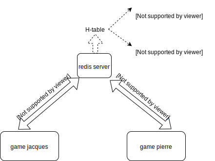

---
jupyter:
  jupytext:
    cell_metadata_filter: all
    formats: ipynb,md
    notebook_metadata_filter: all,-language_info
    text_representation:
      extension: .md
      format_name: markdown
      format_version: '1.1'
      jupytext_version: 1.2.4
  kernelspec:
    display_name: Python 3
    language: python
    name: python3
---

<!-- #region {"trusted": true} -->
# un jeu multi-joueur
<!-- #endregion -->

<!-- #region {"slideshow": {"slide_type": "slide"}} -->
on se propose de réaliser un petit jeu multi joueur, et pour cela nous aurons besoin de 

* [redis](https://redis.io/), un système de base de données *light* et rapide, où les données sont stockées en mémoire; il ne s'agit pas d'un système traditionnel, ici pas de SQL ni de stockage sur le disque;

* [pygame](www.pygame.org), pour le graphisme et autres interactions avec le jeu
<!-- #endregion -->

# architecture


## *process* et isolation

un jeu multi-joueur pose des défis qui vont au-delà de ce qu'on apprend dans un cours de programmation de base

en effet on apprend pour commencer à programmer dans un monde fini et isolé - l'OS appelle ça un *process* - qui par définition ne partage aucune donnée avec les autres programmes qui tournent dans le même ordinateur

typiquement quand vous écrivez un programme Python et que vous le lancez avec `python mon_code.py`, tout le code tourne dans un seul process (sauf si vous faites exprès d'en créer d'autres bien entendu)


## comment partager 

du coup lorsqu'on veut faire jouer ensemble disons deux personnes, on aurait en théorie le choix entre

* faire tourner tout le jeu, c'est-à-dire les deux joueurs, dans un seul process; ce qui pourrait à la limite s'envisager si on accepte la limitation - très forte - où les deux joueurs jouent sur le même ordinateur
* mais bien sûr ça n'est pas une solution en général, donc c'est beaucoup mieux que chaque joueur lance son propre process, qui pourront même du coup tourner sur des ordinateurs différents pourvu qu'on s'y prenne correctement

mais avec cette deuxième approche il faut trouver un moyen d'échanger des informations: chaque process a le contrôle sur la position de son joueur, mais a besoin d'obtenir auprès des autres les positions des autres joueurs


## une solution centralisée


l'architecture la plus simple pour établir la communication entre tous les joueurs consiste à créer un processus central, auquel les joueurs sont connectés, selon un diagramme dit en étoile :





# prototype


ici se trouve un prototype hyper simple; il est multi-joueur mais sur un seul ordinateur (car il manque la possibilité d'indiquer où trouver le serveur central)

pour le mettre en oeuvre :

<!-- #region -->
## serveur

il faut pour commencer lancer un serveur redis 

```bash
redis-server
```

bien sûr ce process **ne termine pas**, il faut le laisser tourner pendant tout le temps du jeu; donc ce terminal va être monopolisé pour ça, créez-en un autre pour lancer les autres morceaux
<!-- #endregion -->

<!-- #region -->
## jeux

### un premier jeu 

```
main.py pierre
```

pareil ici, ce process ne se terminera que lorque pierre aura fini de jouer

### un second

```
main.py paul
```

Pierre voit Paul apparaitre sur son écran, et Paul également

<!-- #endregion -->

## défauts


bien sûr ce prototype a des zillions de défauts :

* les joueurs ne jouent pas vraiment, le jeu choisit des les déplacer de manière aléatoire
* on ne gère pas les conflits, si deux joueurs veulent se rendre au même endroit c'est possible
* tout est fait en une seule boucle à la cadence du rafraichissement; la vitesse de déplacement d'un joueur n'est pas forcément la vitesse de reafraichissement
* il manque un moyen de dire ou de chercher où est le serveur redis; du coup les joeurs doivent forcément être sur le même ordi (et donc le même écran)...
* etc…
