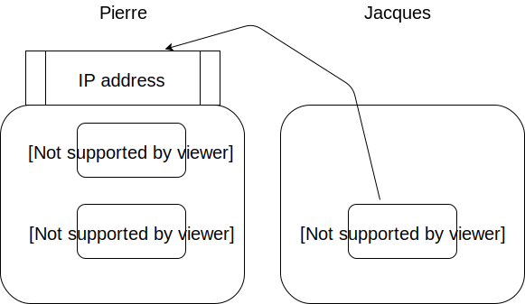

---
jupyter:
  celltoolbar: Slideshow
  jupytext:
    cell_metadata_filter: all
    cell_metadata_json: true
    formats: ipynb,md
    notebook_metadata_filter: all,-language_info
    text_representation:
      extension: .md
      format_name: markdown
      format_version: '1.2'
      jupytext_version: 1.7.1
  kernelspec:
    display_name: Python 3
    language: python
    name: python3
  toc:
    base_numbering: 1
    nav_menu: {}
    number_sections: true
    sideBar: true
    skip_h1_title: false
    title_cell: Table of Contents
    title_sidebar: Contents
    toc_cell: false
    toc_position: {}
    toc_section_display: true
    toc_window_display: false
---

<!-- #region {"trusted": true} -->
# un jeu multi-joueur
<!-- #endregion -->

<!-- #region {"slideshow": {"slide_type": "-"}} -->
on se propose de réaliser un petit jeu multi joueur, et pour cela nous aurons besoin de

* [redis](https://redis.io/), un système de base de données *light* et rapide, où les données sont stockées en mémoire; il ne s'agit pas d'un système traditionnel, ici pas de SQL ni de stockage sur le disque
  **attendez avant de l'installer**, les modalités ne sont pas les mêmes sur tous les OS

* [pygame](www.pygame.org), pour le graphisme et autres interactions avec le jeu
<!-- #endregion -->

# architecture


## *process* et isolation

un jeu multi-joueur pose des défis qui vont au-delà de ce qu'on apprend dans un cours de programmation de base

en effet on apprend pour commencer à programmer dans un monde fini et isolé - l'OS appelle ça un *process* - qui **par définition** ne partage aucune donnée avec les autres programmes qui tournent dans le même ordinateur

typiquement quand vous écrivez un programme Python et que vous le lancez avec `python mon_code.py`, tout le code tourne dans un seul process (sauf si vous faites exprès d'en créer d'autres bien entendu)


## comment partager

du coup lorsqu'on veut faire jouer ensemble, disons deux personnes, on aurait en théorie le choix entre

* faire tourner tout le jeu, c'est-à-dire les deux joueurs, dans un seul process; mais ça impose de jouer tous les deux sur le même ordi, pas glop du tout
* du coup ça n'est pas une solution en général, donc c'est beaucoup mieux que chaque joueur lance son propre process, qui pourront même du coup tourner sur des ordinateurs différents pourvu qu'on s'y prenne correctement

mais avec cette deuxième approche il faut trouver **un moyen d'échanger des informations**: chaque process a le contrôle sur la position de son joueur, mais a besoin d'obtenir les positions des autres joueurs

on va voir comment on peut s'y prendre


## une solution centralisée


l'architecture la plus simple pour établir la communication entre tous les joueurs consiste à créer un **processus serveur**, auquel les joueurs sont connectés, selon un diagramme dit en étoile (terme qui prend tout son sens avec plusieurs joueurs: le serveur est au centre du diagramme) :


# prototype


ici se trouve un **prototype** hyper simple; il est multi-joueur mais sur un seul ordinateur (car il manque la possibilité d'indiquer où trouver le serveur central)

pour le mettre en oeuvre :

<!-- #region -->
## serveur

il faut pour commencer lancer un serveur redis
(après avoir installé [l'outil redis](https://redis.io/), bien entendu)

```bash
redis-server --protcted-mode no
```

bien sûr ce process **ne termine pas** (vous remarquez que le shell ne vous affiche pas le *prompt* avec le `$`)

il faut le laisser tourner pendant tout le temps du jeu; donc ce terminal va être monopolisé pour ça, créez-en un autre pour lancer les autres morceaux
<!-- #endregion -->

## jeux

### requirements

```shell
pip install redis
```

### un premier jeu

```shell
python multi-game.py pierre
```

pareil ici, ce process ne se terminera que lorque pierre aura fini de jouer

### un second

```shell
python multi-game.py paul
```

Pierre voit Paul apparaitre sur son écran, et Paul également;

### etc...

on peut lancer d'autres jeux en même temps, mais bien sûr l'espace libre sur l'écran devient rapidement


## défauts


bien sûr ce prototype a des zillions de défauts :

* les joueurs ne jouent pas vraiment, le jeu choisit des les déplacer de manière aléatoire
* on ne gère pas les conflits, si deux joueurs veulent se rendre au même endroit c'est possible
* tout est fait en une seule boucle à la cadence du rafraichissement; la vitesse de déplacement d'un joueur n'est pas forcément la vitesse de reafraichissement
* il manque un moyen de dire ou de chercher où est le serveur redis; du coup les joeurs doivent forcément être sur le même ordi (et donc le même écran)...
* etc…


# le code


https://github.com/flotpython/slides/tree/master/tps/redis

n'oubliez pas de lancer le serveur *redis* **d'abord**, ça ne va pas fonctionner sinon.


# plusieurs ordinateurs


jusqu'ici on a fait tourner tous les processus dans le même ordinateur

en vraie grandeur bien sûr, on veut faire tourner ça sur plusieurs ordinateurs



pour que ça puisse fonctionner dans ce type de configuration il faut que Jacques lance le jeu en lui indiquant sur quel ordinateur se trouve le serveur redis


## trouver son IP address


selon les systèmes, lancez dans un terminal la commande suivante
* Windows `ipconfig`
* MacOS `ifconfig`
* LInux `ip address show`

et cherchez une adresse parmi les intervalles réservés aux adresses privées


<!-- #region {"slideshow": {"slide_type": "-"}} -->
## pour lancer le jeu

dans notre configuration, si Pierre est sur l'adresse disons `192.168.200.20`, il suffit aux autres joueurs qui veulent le rejoindre de lancer par exemple

```
multi-game.py --server 192.168.200.20 Jacques
```
<!-- #endregion -->

# Notes

## scope

faut-il simplifier le jeu ?

## Précisions multi-OS

### general

* lancer redis-server --protected-mode no
* lancer redis-server --bind 0.0.0.0
* ouvrir le firewall

### Windows

* pas supporté par le site principal, installer redis avec `conda install redis`
* firewall : compliqué

* autre option: memurai
* dont l'installation se charge de créer un service microsoft

### linux / fedora

* dnf install redis
* si firewalld: sudo firewall-cmd --zone=public --permanent --add-port=6379/tcp
